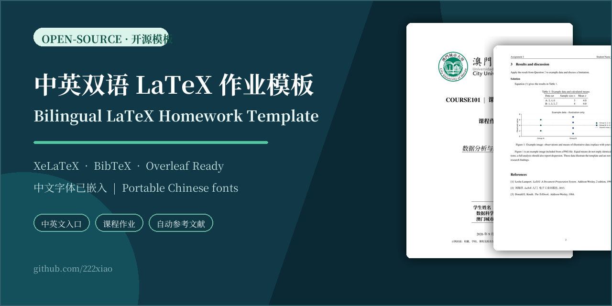
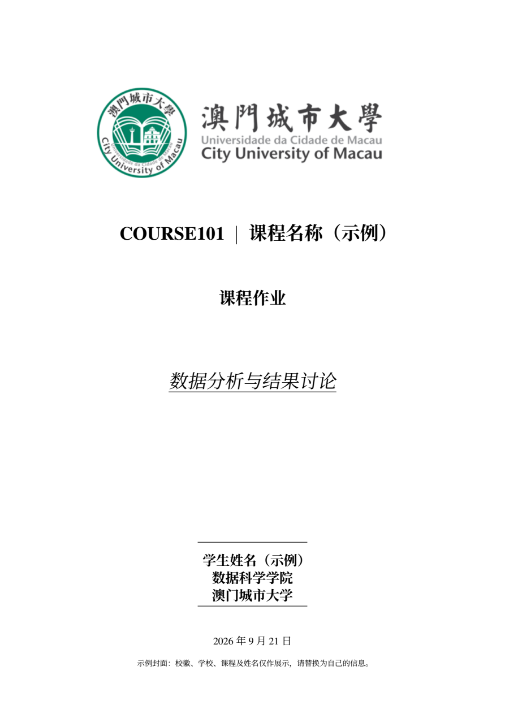
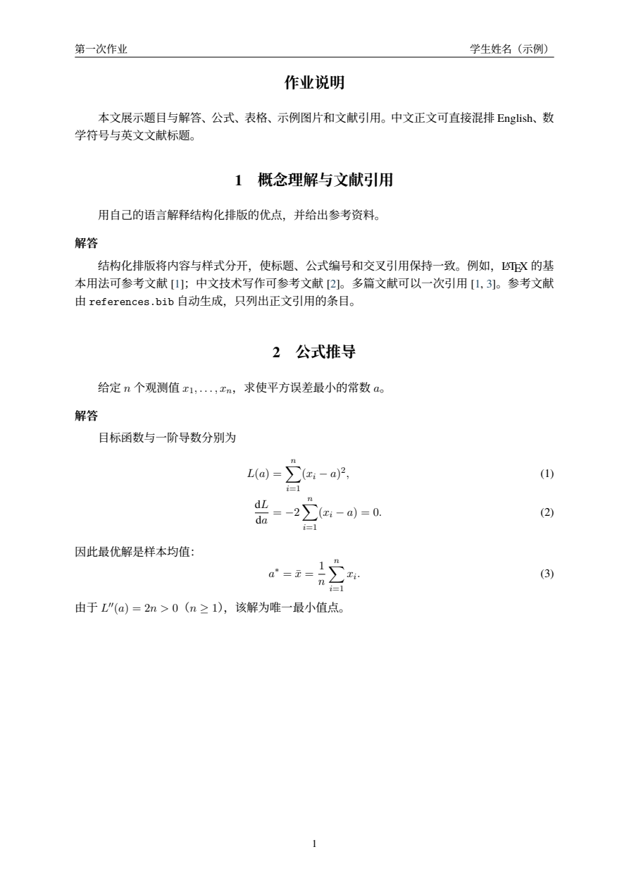
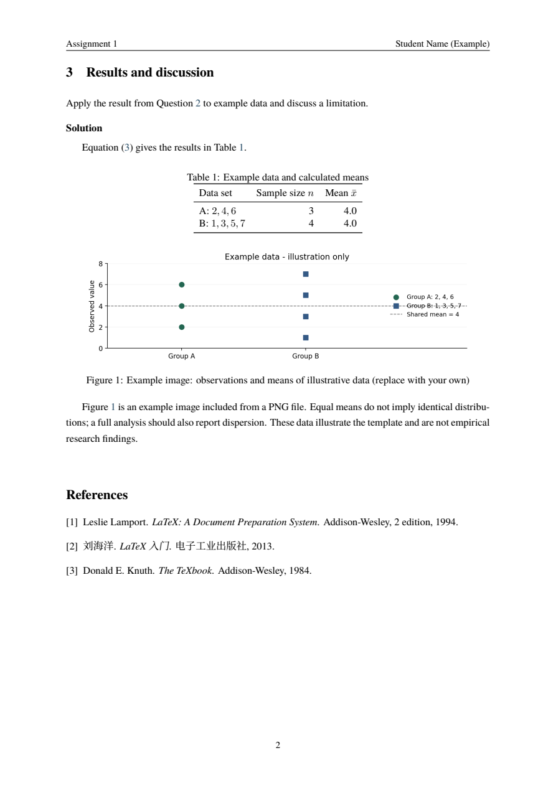
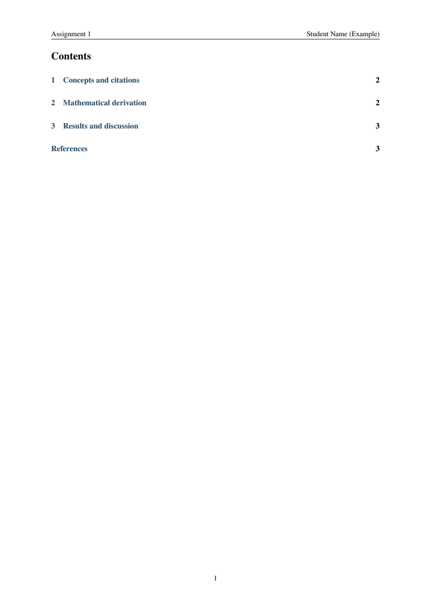

<div align="center">

# Bilingual LaTeX Homework Template

## 中英双语 LaTeX 作业模板

**A clean, ready-to-use XeLaTeX assignment template for Chinese and English coursework.**<br>
**适用于中文、英文及中英混排课程作业的通用 XeLaTeX 模板。**

[](https://github.com/222xiao/City-University-of-Macau_Homework-Project-Latex-Template/actions/workflows/latex.yml)


[**Open in Overleaf**](https://www.overleaf.com/docs?snip_uri=https%3A%2F%2Fgithub.com%2F222xiao%2FCity-University-of-Macau_Homework-Project-Latex-Template%2Farchive%2Frefs%2Fheads%2Fmain.zip)
·
[**Download ZIP**](https://github.com/222xiao/City-University-of-Macau_Homework-Project-Latex-Template/archive/refs/heads/main.zip)
·
[中文说明](#中文使用说明)
·
[English Guide](#english-guide)



</div>

> [!NOTE]
> 澳门城市大学校徽、学校名称、课程、姓名以及示例图表仅用于展示模板效果，请替换为自己的信息。本项目是个人设计的通用模板，并非任何院校的官方格式。<br>
> The university logo, institution, course, name, and chart are examples only. Replace them with your own information. This is a community template, not an official university document.

## Preview · 效果预览

| Original-style cover · 原版风格封面 | Chinese homework · 中文作业 |
| :---: | :---: |
|  |  |

| English homework · 英文作业 | Optional contents · 可选目录 |
| :---: | :---: |
|  |  |

## Why this template? · 模板特点

| Feature | 中文说明 | English |
| --- | --- | --- |
| Bilingual | 中文、英文两个入口，均支持中英文混排 | Separate Chinese and English entry points with mixed-language support |
| Portable Chinese PDF | 自带开源中文字体，嵌入 Unicode 映射，减少预览缺字或乱码 | Bundled open-source Chinese fonts with embedded Unicode mapping |
| Homework structure | 包含题目、解答、公式、表格、图片和交叉引用示例 | Examples for problems, solutions, equations, tables, figures, and references |
| Easy configuration | 学校、课程、姓名、教师、日期和校徽集中配置 | Configure institution, course, author, instructor, date, and logo in one file |
| Flexible layout | 独立封面、紧凑首页和目录均可切换 | Choose a full cover, compact first page, and optional table of contents |
| Bibliography | 使用 UTF-8 `.bib` 文件，通过 BibTeX 自动生成参考文献 | UTF-8 `.bib` database with automatic BibTeX bibliography |
| Continuous check | GitHub Actions 自动编译中英文入口并检查引用 | GitHub Actions builds both languages and checks references |

## 中文使用说明

### 1. 在 Overleaf 使用

点击上方 **Open in Overleaf**，或下载仓库 ZIP 后在 Overleaf 选择 **New Project → Upload Project**。请上传完整项目，不要只上传 `main.tex`。

在 Overleaf 项目设置中：

1. Compiler 选择 **XeLaTeX**。
2. 中文作业的 Main document 选择 `main.tex`。
3. 修改 `config-zh.tex` 中的课程与个人信息。
4. 用自己的内容替换 `contents/homework-zh.tex`。
5. 文献添加到 `references.bib`，正文使用 `\citep{引用键}`。

若引用或交叉引用出现 `?`，选择 **Recompile from scratch** 后重新编译。

### 2. 修改封面信息

所有封面信息集中在 `config-zh.tex`：

```tex
\homeworksetup{
  assignment={课程作业},
  title={第一次课程作业的具体题目},
  short-title={作业一},
  university={学校名称},
  department={学院名称},
  course={课程名称},
  course-code={COURSE101},
  author={姓名},
  student-id={12345678},
  instructor={教师姓名},
  date={2026-09-21},
  logo={your-logo.png},
  example-note={}
}
```

- `assignment`：作业类型，例如“课程作业”或“课程报告”。
- `title`：封面下划线题目，也是 PDF 标题。
- `short-title`：页眉短标题，建议保持简短。
- `logo`：支持 PNG、JPG 或 PDF；设为 `{}` 可隐藏校徽。
- `example-note`：示例提醒。替换全部示例信息后可设为 `{}`。
- 学号、教师等可选字段设为 `{}` 后会自动隐藏。

默认封面延续原项目的布局：大校徽、居中课程名、作业类型、下划线题目、上下横线作者栏和日期。

### 3. 切换版式

在 `config-zh.tex` 中取消注释：

```tex
\homeworkcoverfalse % 使用紧凑首页，不生成独立封面
\homeworktoctrue    % 添加目录
```

短作业通常适合紧凑首页；篇幅较长的课程报告可以使用独立封面和目录。

### 4. 编写题目与解答

```tex
\problem{题目标题}
\label{sec:question}
这里写题目。

\begin{solution}
这里写答案，也可以加入列表、公式、表格和图片。
\begin{equation}
  E = mc^2
  \label{eq:energy}
\end{equation}
引用公式：式~\eqref{eq:energy}。
\end{solution}
```

`\problem` 会生成带编号的节标题，并可自动进入目录。报告型作业也可以直接使用 `\section` 和 `\subsection`。

项目中的 `figures/example-results.png` 是实际 PNG 插图，但数据仅用于排版展示。替换图片时可使用：

```tex
\includegraphics[width=0.85\linewidth]{figures/your-figure.png}
```

### 5. 添加参考文献

在 `references.bib` 中添加真实资料：

```bibtex
@book{mybook,
  author    = {{张三} and {李四}},
  title     = {书名},
  publisher = {出版社},
  year      = {2026}
}
```

正文引用：

```tex
\citep{mybook}                       % 数字编号引用
\citep{lamport1994,knuth1984}         % 同时引用多篇
\citet{lamport1994}                  % 作者加编号
```

模板默认采用 `natbib` + `unsrtnat`，按首次引用顺序编号。它是通用数字引用格式，不是 GB/T 7714、APA 或学校专用规范；如课程有明确要求，请替换相应的文献样式。

### 6. 本地编译

需要安装包含中文支持的 TeX Live、MacTeX 或 MiKTeX，以及 `latexmk`：

```sh
latexmk              # 编译中文与英文入口
latexmk main.tex     # 中文 -> main.pdf
latexmk main-en.tex  # 英文 -> main-en.pdf
latexmk -c           # 清理中间文件
```

请使用 **XeLaTeX + BibTeX**。本模板不使用 Biber，也不支持 pdfLaTeX。

## English Guide

### Quick start with Overleaf

Use the **Open in Overleaf** link above, or download the repository ZIP and choose **New Project → Upload Project** in Overleaf. Upload the entire project because the template depends on the bundled `fonts/` directory.

1. Select **XeLaTeX** as the compiler.
2. Set `main-en.tex` as the Main document.
3. Edit course and author information in `config-en.tex`.
4. Replace `contents/homework-en.tex` with your assignment.
5. Add sources to `references.bib` and cite them with `\citep{key}` or `\citet{key}`.

Use `main.tex`, `config-zh.tex`, and `contents/homework-zh.tex` for the Chinese version. Both entry points support mixed Chinese and English text.

### Customize the cover

The original visual layout is retained: a large logo, centered course name, assignment type, underlined topic, ruled author block, and date. All values in `config-en.tex` are replaceable examples.

- `assignment` controls the assignment type.
- `title` controls the underlined topic and PDF title.
- `short-title` appears in the page header.
- `logo={your-logo.png}` loads your image; `logo={}` hides it.
- Empty optional fields are omitted automatically.
- Clear `example-note={}` after replacing the sample information.

Enable `\homeworkcoverfalse` for a compact first-page heading or `\homeworktoctrue` for a contents page.

### Fonts and PDF compatibility

The `fonts/` directory contains static Noto Serif SC files under the SIL Open Font License 1.1. XeLaTeX embeds the used glyphs and explicit Unicode mappings, which prevents missing Chinese text in PDF previewers. Keep the complete `fonts/` directory when copying or uploading the project. Font provenance and license details are in [`fonts/README.md`](fonts/README.md).

### Build locally

Install a complete TeX Live, MacTeX, or MiKTeX distribution with Chinese support, then run:

```sh
latexmk main-en.tex
```

The included `.latexmkrc` selects XeLaTeX and runs BibTeX when needed.

## Project structure · 文件结构

```text
main.tex                    Chinese entry point / 中文入口
main-en.tex                 English entry point / 英文入口
homework.cls                Shared class, fonts, layout, and commands
config-zh.tex               Chinese metadata and display options
config-en.tex               English metadata and display options
document.tex                Shared document structure
contents/homework-zh.tex    Chinese sample assignment
contents/homework-en.tex    English sample assignment
references.bib              Shared UTF-8 bibliography database
cityu.png                   Replaceable example logo / 示例校徽
figures/example-results.png Replaceable example figure / 示例插图
fonts/                      Bundled Chinese fonts and OFL license
.latexmkrc                  XeLaTeX build configuration
.github/workflows/latex.yml Continuous compilation check
```

## FAQ · 常见问题

<details>
<summary><strong>PDF 中文缺字或乱码怎么办？ / Chinese text is missing in the PDF</strong></summary>

Use the latest complete project, select XeLaTeX, and keep the `fonts/` directory. Delete old build files or choose **Recompile from scratch** in Overleaf. The current fonts include embedded Unicode mappings and have been checked with multiple PDF renderers.

</details>

<details>
<summary><strong>引用显示问号 / Citations show question marks</strong></summary>

Check that the citation key exists in `references.bib`, confirm that the BibTeX braces are balanced, and run the complete build again.

</details>

<details>
<summary><strong>可以用于其他学校吗？ / Can I use it at another university?</strong></summary>

Yes. Replace the logo and metadata in `config-zh.tex` or `config-en.tex`. The City University of Macau information is only an example and does not restrict usage.

</details>

<details>
<summary><strong>语言选项会自动翻译作业吗？ / Does the language option translate my content?</strong></summary>

No. It changes template labels and selects the corresponding sample content. Your assignment text must be written or translated separately.

</details>

## Contributing · 参与改进

Bug reports, formatting improvements, and additional citation-style examples are welcome through [GitHub Issues](https://github.com/222xiao/City-University-of-Macau_Homework-Project-Latex-Template/issues). If this template helps with your coursework, consider starring the repository so more students can find it.

项目中的大学标识仅作为可替换的演示素材。使用其他学校的名称或校徽时，请遵守相应机构的品牌规范。
